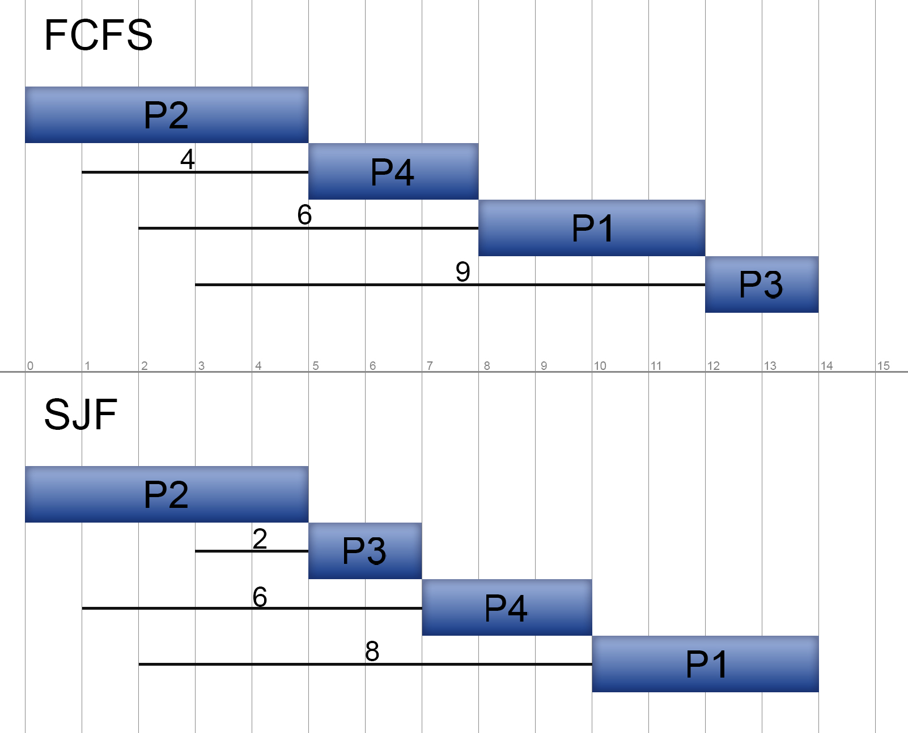

# Übung 7.1: Scheduling für Uniprozessor-Systeme

a) Was macht der Kernel-Scheduler?
```
Der Kernel-Scheduler sorgt dafür, dass jeder aktuell laufende Prozess seine Rechenzeit zugewiesen bekommt.
Ermöglicht einen "Mehrprogrammbetrieb" und somit eine Quasiparallelität
```

b) Was sind die Anforderungen an den Kernel-Scheduler aus Benutzersicht?
```
Jedes Programm (bzw jeder Prozess) soll möglichst schnell laufen.
Dabei sollten jedoch Prozesse mit einem Fenster, welches gesehen wird, besonders flüssig laufen.
Echtzeitbenutzer wollen zwingend dass Schranken eingehalten werden.
```
c) Was sind die Anforderungen an den Kernel-Scheduler aus Systemsicht?
```
Möglichst faire Aufteilung und kein Prozess darf untergehen.
Möglichst höher Durchsatz, maximierung der Prozessorlast
```

d) Zeichnen Sie Prozess-Zeit-Diagramm für den Scheduling-Algorithmus FirstCome First-Served (FCFS) und Shortest Job First (SJF) mit den folgenden Prozessinformationen und berechnen Sie die Wartezeit für jeden Prozess und die
durchschnittliche Wartezeit.

| Prozess | Ankunft | Ausführzeit | Wartezeit (FCFS/SJF) |
| --- |:---:|:---:|:---:|
| P1 | 2 | 4 | 6/8 |
| P2 | 0 | 5 | 0/0 |
| P3 | 3 | 2 | 9/2 |
| P4 | 1 | 3 | 4/6 |
|  |  |  | 4,75/4 |




e) Für welchen Typ von Computersystem sind FCFS und SJF besonders geeignet?
```
Für Stapelverarbeitungssystem.
```

f) Was ist der Unterschied zwischen einem nicht-präemptiver und einem präemptiver Scheduling Algorithmus? Um welche Form von Scheduling-Algorithmus
handelt es sich bei FCFS und SJF?
```
Nicht-präemptive Algorithmen können im gegensatz zu präemptiven keinen gestarteten Prozess anhalten und müssen dadurch Prozesse stets bis zur beendung durchführen.
Bei FCFS und SJF handelt es sich um nicht-präemptive Algorithmen.
```

g) Zeichnen Sie Prozess-Zeit-Diagramm für den Scheduling-Algorithmus Round
Robin (RR) mit den Prozessinformationen von Aufgabe 7.1d und berechnen
Sie die Wartezeit für jeden Prozess und die durchschnittlicher Wartezeit aller Prozesse. Quantum = 3.
```
```

h) Was passiert wenn das Quantum für Round Robin (RR) zu groß gewählt ist?
```
```
